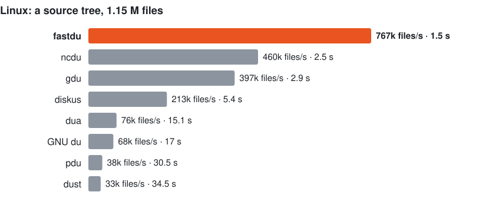
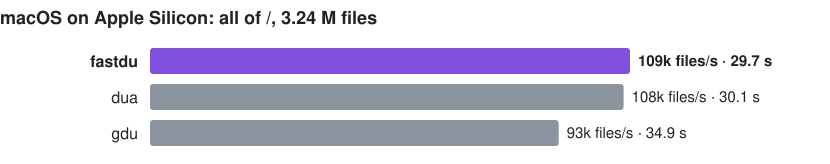
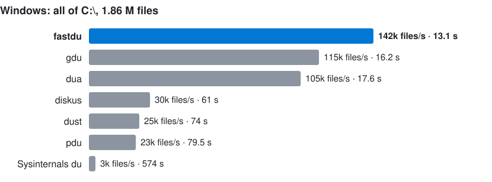

# fastdu

[](https://github.com/jimmy927/fastdu/actions/workflows/build.yml?query=branch%3Amain)
[](https://github.com/jimmy927/fastdu/actions/workflows/gnu-du-tests.yml?query=branch%3Amain)
[](https://github.com/jimmy927/fastdu/releases/latest)

Folder sizes, fast, on Windows, Linux and macOS: a `du` that uses every core
and asks the file system as little as it can. Two small C files, one for
Windows and one for Linux and macOS, no dependencies.

All of `C:\` (1.86 million files) takes 13 seconds, where gdu takes 16 and dua
18. A 1.15-million-file source tree on Linux takes 1.5 seconds, where ncdu takes
2.5 and gdu 2.9 ([benchmarks](#benchmarks)).

## Install

Download a binary from [Releases](https://github.com/jimmy927/fastdu/releases/latest):

| System | File |
|---|---|
| Windows, x64 | `fastdu-windows-x64.exe` |
| Linux, x64 | `fastdu-linux-x64` (static) |
| Linux, arm64 | `fastdu-linux-arm64` (static) |
| macOS 11 or later, Intel and Apple Silicon | `fastdu-macos` |

```sh
curl -Lo fastdu https://github.com/jimmy927/fastdu/releases/latest/download/fastdu-linux-x64
chmod +x fastdu
```

`SHA256SUMS` beside them lists their checksums. Or [build it](#build).

The macOS binary is not notarised: fetched with `curl` it runs as it is, but
one downloaded in a browser is stopped by Gatekeeper until
`xattr -d com.apple.quarantine fastdu-macos`.

## Use

fastdu is GNU du: the same options, the same output, the same exit status, on
every core. Put it where `du` is, or alias it.

```
$ fastdu -sh ~/src
45G     /home/jimmy/src
$ fastdu -h -d 1 -t 1G 'C:\Program Files'
6.7G    C:\Program Files\JetBrains
44G     C:\Program Files
```

Every one of du's options works as du's does — `-a`, `-b`, `-B SIZE`, `-c`,
`-D`/`-H`, `-d N`, `--files0-from`, `-h`, `--inodes`, `-k`, `-L`, `-l`, `-m`,
`-P`, `-S`, `--si`, `-s`, `-t SIZE`, `--time[=WORD]`, `--time-style`,
`--exclude`, `-X`, `-x`, `-0` — as do `DU_BLOCK_SIZE`, `BLOCK_SIZE`,
`BLOCKSIZE`, `POSIXLY_CORRECT` and `TIME_STYLE`, and long options may be
shortened as du's may (`--max=1`). Messages name the program as it was
started, so installed as `du` it reports as `du`. `fastdu --help` lists the
options.

Two sets of tests hold it to that, on Linux and macOS, on every build:

- **GNU's own**: coreutils' `tests/du` suite (31 tests), run with fastdu in
  du's place ([`test/gnu-du.sh`](test/gnu-du.sh) downloads and builds coreutils
  9.12; the tests are GPLv3 and stay there). fastdu passes every test GNU du
  passes on the same machine; the rest skip for both (they need root, a 2 GiB
  file, or tools the machine lacks).
- **Side by side**: ~70 option sets on one tree, fastdu's output against GNU
  du's line for line, at one thread and at eight ([`test/unix.sh`](test/unix.sh);
  coreutils 9.4 on Linux, 9.11 on macOS).

Where du's answer depends on how it walks, fastdu gives du's answer: paths are
walked one after another, so what two share counts under the first, and with
`-L` a path may pass no more symbolic links than one kernel lookup allows (40
on Linux, 32 on macOS; "Too many levels of symbolic links", as du says) — though
fastdu opens each folder from its parent and could go on. As in GNU du 9,
`--apparent-size` counts a folder's own size as 0.

fastdu adds three, written out in full: they never shorten, so `--th` stays
du's `--threshold` and `--files` du's `--files0-from`.

| Option | |
|---|---|
| `-j N`, `--threads=N` | threads to walk with (default: one per logical processor; on macOS more while they wait on the disk) |
| `-p`, `--progress` | `progress<TAB>folders<TAB>files<TAB>bytes` on standard error each second |
| `--file-count` | a column with the number of files under each entry, after its size |

**On Windows** the listing is all fastdu reads, so a few things cannot be as
du's: sizes are the allocation size (`--apparent-size`: file lengths, what
Explorer shows), a hard-linked file counts at each of its names (`-l` changes
nothing), junctions and symbolic links are entries of their own and never
followed but for a path given with `-D`, `-L` is refused (junction loops
cannot be told from the listing), and nothing mounted inside a folder is walked
into (`-x` changes nothing). `C:` means the drive's root; `\\?\` and
`\\server\share` paths work too.

**On macOS**, `/Users` and `/System/Volumes/Data/Users` are the same folders on
the same volume (a firmlink), so walking `/` counts them twice, as du does. A
hard-linked file is counted once; macOS's own `du` counts it again when it is
met under more paths than it has links.

## How it is fast

Opening a folder and listing it is cheap; asking the file system about every
file in it is what costs. Everything else is arranged around that.

### Windows

Windows' directory listing already carries each file's size, so a whole drive is
summed from the listings alone: no file is opened, and nothing is asked per
file.

- Each folder is opened relative to its parent's open handle
  (`NtOpenFile` with a `RootDirectory`), so the kernel looks up one name
  rather than parsing a whole path component by component.
- Folders are listed 256 KB at a time with `NtQueryDirectoryFile`, where
  `FindNextFile` returns small batches. Entries are read in place from that
  buffer; only folder names are copied, into per-thread memory arenas that are
  never freed before exit.
- A thread walks its own subtree depth-first, keeping its parents' handles
  open, and hands folders to a shared stack only while another thread is idle.

It is bound by the kernel: with 16 threads on 8 cores Windows sits at 100 % CPU,
75–97 % of it in the kernel (NTFS and Defender's file-system filter), and 16
threads are 5.2 times as fast as one. Opening a folder costs about 99 µs cold
and 21 µs warm.

### Linux

A Linux directory listing has names, inode numbers and types, but no sizes, so
files need a `stat`. Those stats cost 4.3 µs each here, 70 % of a one-thread
walk, so there are as few as possible:

- Folders are listed with `getdents64` into 1 MB buffers, and each file is
  stat-ed with `fstatat` relative to its folder's descriptor.
- A folder is never stat-ed from its parent: its own blocks and file system
  come from `fstat` on the descriptor it is listed through.
- A file whose inode number (which the listing gives for free) was already seen
  is another name for a file already counted, and is skipped without a stat. A
  source tree with `node_modules` hard-linked between checkouts had 2.49 million
  names for 1.15 million files.
- A listing that leaves the buffer part-empty was the whole folder, so the
  call that would only say "end" is skipped.

Those three took one thread from 8.45 s to 5.37 s on that tree. Work is shared
between threads as on Windows.

### macOS

macOS's `getattrlistbulk` lists a folder and returns, with each name, whatever
attributes are asked for: here its kind, file ID, link count and allocated size.
So, as on Windows, nothing is stat-ed per file, and only a file with more than
one link is looked up in the set of files already counted. Folders are walked
and shared between threads as on Linux (the same source, `src/unix/fastdu.c`).

It starts with one thread per logical processor and adds more while they mostly
wait on the disk: every 100 ms, if every thread is walking and together they
used under half their processor time, a processor's worth more start, up to 8
per processor. On a 3-processor Apple Silicon runner that took all of `/` from
43.6 s (3 threads) to about 30 s; on a Mac whose disk answers from memory the
threads stay busy and none are added.

### What did not help

- **Ending a Windows listing at a short batch.** NTFS returns batches that leave
  the buffer part-empty in the middle of a folder: stopping at one counted
  1,171,304 files on `C:\` where there were 1,856,491. Only "no more files" ends
  a listing.
- **Opening Windows folders by file ID** (`FILE_OPEN_BY_FILE_ID`, from the
  listing's IDs): 0.63 s against 0.34 s on `C:\Program Files`.
- **Handing work out more or less eagerly**: no difference.
- **`statx` instead of `fstatat`**: no difference.
- **Stat-ing a folder's files in inode order**: slower.

## Benchmarks







Where a tool's time varied between rounds, the chart shows the middle of its
range. `python3 bench/chart.py` redraws the charts.

**Linux and Windows**, on one laptop, 2026-09-27: AMD Ryzen 9 5900HS (8 cores,
16 threads), Windows 11 (build 26200) with Defender's real-time protection on,
and Linux in WSL 2 (kernel 6.18) on ext4. Five interleaved rounds with warm
caches, medians; the machine was busy with other work (load average 14–20), and
fastdu was fastest in every round. On a quiet machine it reads `C:\` in about
10.5 s.

**macOS**, on GitHub's Apple Silicon runner (Apple M1, virtual, 3 logical
processors), all of `/` (3.24 M files), 2026-09-27: a warm-up and three
interleaved rounds, medians ([`benchmark-macos`](.github/workflows/benchmark-macos.yml),
started by hand). Its disk is slow and does not all fit in memory, so these
are mostly waits on the disk; fastdu was ahead in two of the three rounds.

The tools: [gdu](https://github.com/dundee/gdu) 5,
[dua](https://github.com/Byron/dua-cli) 2.45 (which missed ~110 GiB of `C:\` to
permission errors), [ncdu](https://dev.yorhel.nl/ncdu) 2.9 with `-t 16`,
[diskus](https://github.com/sharkdp/diskus) 0.9,
[dust](https://github.com/bootandy/dust) 1.2,
[pdu](https://github.com/KSXGitHub/parallel-disk-usage) 0.24,
[Sysinternals du](https://learn.microsoft.com/sysinternals/downloads/du), and
the systems' own `du`.

Tools that read NTFS's master file table directly, such as WizTree and
Everything, are faster still on Windows, but need administrator rights and are
not command-line tools. fastdu needs no rights beyond reading the folders.

## Build

Linux and macOS, with any C compiler (on macOS, `xcode-select --install`):

```sh
make            # ./fastdu
make test       # ~70 option sets, each against GNU du (on macOS: brew install coreutils)
sudo make install
```

Windows, with Visual Studio's C compiler (the free Build Tools will do), from an
"x64 Native Tools Command Prompt":

```bat
build.bat
powershell -ExecutionPolicy Bypass -File test\windows.ps1 -Fastdu .\fastdu.exe
```

Each tagged version `vX.Y.Z` is built, tested and released by
[GitHub Actions](.github/workflows/build.yml).

## Licence

[MIT](LICENSE)
